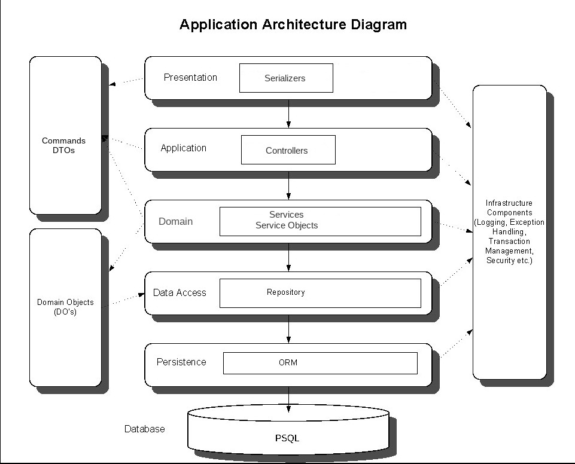
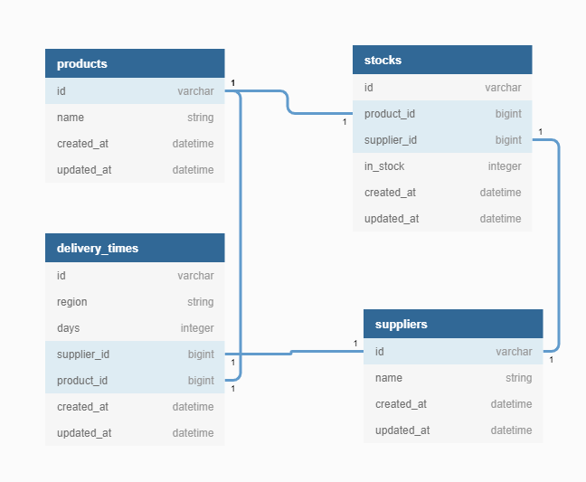

[](https://travis-ci.org/hugocore/e-commerce-shop)
[](https://codeclimate.com/github/hugocore/e-commerce-shop/maintainability)
[](https://codeclimate.com/github/hugocore/e-commerce-shop/test_coverage)
[](https://coveralls.io/github/hugocore/e-commerce-shop?branch=master)

# E-Commerce Shop

Sample of an e-commerce shop made in Rails API that follows
a domain-driven architecture.

# Usage

Run this project with Docker:

```
docker-compose build
docker-compose run --rm web rake db:reset
docker-compose run --rm web rspec
```

Or, locally by creating an `.env` file with:

```
DB_HOST=...
DB_USER=...
DB_PASSWORD=...
```

And then running:

```
bundle install
RAILS_ENV=test rake db:create
rspec
```

# Code Quality

- Run rspec via Spring to speed up preloading with:

```
docker-compose run --rm web bash
bundle exec spring rspec
```

- Check test coverage locally:

```
open coverage/index.html
```

- A git commit hook runs Rubocop to validate changes, to skip it run:

```
SKIP=RuboCop git commit
```

- Travis makes sure the repo keeps building:

https://travis-ci.org/github/hugocore/e-commerce-shop

- Coveralls shows test coverage at:

https://coveralls.io/github/hugocore/e-commerce-shop

- Codeclimate checks code quality for every build at:

https://codeclimate.com/github/hugocore/e-commerce-shop

# The problem

- Implement a REST API that calculates the number of days to
deliver multiple shipments originating from different
suppliers spread around the world.

- Not all suppliers supply all products, so it might be
necessary to collect partial shipments from different suppliers
to fulfil one order.

- Every supplier operates in different regions and shipments
from those regions might take different amounts of time to
deliver the same product.

- Hence, the problem is knowing which suppliers to pick
to provide the less amount of shipments,
in the quickest fashion.

## Assumptions

- An order's basket consists of a `region` and `line items`.
Each `line item` have a `quantity` and `name` to depict
a product.

- The criteria in which suppliers are allocated to fulfil
a basket is based on the least amount of shipments necessary to
deliver the order. When tied, the quickest supplier is chosen.
This strikes a balance between the cost to fulfil the order
and the time the customer is waiting to receive it. For instance:

| Product | Supplier | Delivery days | Stock | Shipments by Supplier |
|---------|----------|---------------|-------|-----------------------|
| T-Shirt | A        | 1             | 1     | 1                     |
| Hoodie  | C        | 1             | 1     | 1                     |
| T-Shirt | B        | 2             | 1     | 2                     |
| Hoodie  | B        | 2             | 1     | 2                     |
| T-Shirt | D        | 1             | 1     | 2                     |
| Hoodie  | D        | 1             | 1     | 2                     |

In this example, the supplier *B* is chosen, because although
B and D could provide the same products and cover all the
necessary shipments (shipments by supplier = 2), compared with
D, is one day quicker to deliver the products.

# Solution

Following the [c4model](https://c4model.com/) I will describe my solution from a
top-down approach, i.e. from Context, Containers, Components to Code.

## Context

This API is going to be used by external clients that communicate
through HTTP requests that follow a REST protocol.

## Containers

To run the API a web server and an application server was required.
In this case, I decided to use *Ruby on Rails API* as my web framework for
simplicity and to get a web and application server up and running quickly.
The application server ('Ruby on Rails') persists data into a database running
PostgreSQL.

### Components



I wanted to achieve an architecture that would:
- allow the code to be easily maintained and continuously evolved
- loosely designed without dependencies between layers to facilitate future changes
- aligned with business rules that were incrementally added
- highly isolated to help keep high levels of testing coverage
- easy to read and get to known, by just looking at the layers
- adhere to the SOLID principles and object composition

With these reasons in mind, I've decided to follow a *Domain-Driven Design*,
where the following layers are stacked together:

* Application - Controllers receive HTTP requests that validate parameters and pass
down actions to services in the lower layer, i.e. domain layer, through DTOs.

* Domain - This layer keeps the logic that applies to the underlying
models, bounded in contexts about the many operations the system can do. Every
domain is composed of services, repositories and other classes that make sense
to be together and where a clear boundary of responsibility is defined. These are
the existing domains:

> Checkout - This domain deals with the process of allocating stock to a basket,
based on criteria that favours fewer shipments per order.

* Data access - Middle layer that abstracts the data storage implementation chosen by a repository
of data models that follow the same interfaces but can act on different data storages. In this
project, it seemed overkill to have this layer due to the small number of models and their
simplicity. Thus I just coupled services and ActiveRecord directly.

* Data layer - Controls the data storage. To keep things simple in this project,
I've used ActiveRecord to manage the system's entities a.k.a data models. These are the data models represented in
an Entity–relationship model diagram (ERD):



* Database - Keeps the data stored. For simplicity, I've chosen PostgreSQL
due to its acceptable speed and easy to use. Another database, like Redis,
could have been used to optimize the system's speed.

More info at:
- https://blog.arkency.com/application-service-ruby-rails-ddd/
- https://medium.com/@slavakorolev/domain-driven-design-for-ruby-on-rails-d3dd4a606677
- https://github.com/paulrayner/ddd_sample_app_ruby
- https://github.com/Creditas/ddd-rails-sample

### Code

#### CheckoutService

This service coordinates the necessary steps to figure out
what stock is going to be allocated for each basket and
pick the necessary stock to fulfil the quantities needed.

```ruby
module Checkout
  class CheckoutService
    include AutoInject['stock_allocation_service']
    include AutoInject['stock_reduce_service']

    def call(command)
      allocated_stock = stock_allocation_service.call(...)

      stock_reduce_service.call(...)
    end
  end
end

```

By extrapolating the orchestration into one class, we are
decoupling the inner steps from each other and segregate
each component to control the order and way they work together.

At any given time, new steps could be introduced or removed
without affecting the other inner steps.

#### StockAllocationService and StockAllocationQuery

In the `StockAllocationService` and `StockAllocationQuery`
is where the logic that implements the allocation criteria
described before, lives.

Essentially, the `StockAllocationQuery` allocates all the stock
available for the products in the basket and then
sorts it by the preference in which suppliers that cover
more products/deliveries, from top to bottom.

Thus, when reducing the stock, the order is important because
it will enable the best options to be picked first. Also,
when there's a tie between suppliers, the quickest one to
deliver is the one chosen.

Looking at this from a SQL point of view, it would be something
like this:

```SQL
 SELECT
    COUNT(*) AS count_all,
    stocks.supplier_id AS stocks_supplier_id,
    delivery_times.days AS delivery_days
  FROM stocks
    LEFT OUTER JOIN delivery_times
      ON delivery_times.product_id = stocks.product_id
      AND delivery_times.supplier_id = stocks.supplier_id
      AND delivery_times.region = 'eu'
  WHERE stocks.product_id IN (1,2)
  GROUP BY stocks.supplier_id, delivery_times.days
  ORDER BY count_all DESC, delivery_days ASC
```

This way, we know the preference in which suppliers should be
allocated to supply their stock. After this, we reduce
the options until all the necessary amount is fulfilled, one
by one.

#### StockReduceService

Independently of the stock allocated, we need to reduce stock
, i.e. pick which stock will fulfil each order. Although this is
more straightforward, is also more time-consuming.

For each line item in the basket, we take every stock line item
one by one, until the required amount to fulfil the line item's
quantity.

```ruby
    def reduce_stock
      line_items.map do |line_item|
        product = Product.find_by(name: line_item.name)
        quantity = line_item.quantity
        product_stock = stock_for_product(product)
        reduce_product_stock(product_stock, quantity)
      end
    end
```

#### Shipments

This _Service Object_ only concern is to hold individual
stock line items and convert them to shipments in the format
requested:

```
{
  delivery_date: '2020-03-10',
  shipments: [
    {
      supplier: "Shirts4U",
      delivery_date: '2020-03-09'
      items: [
        {
          title: "tshirt",
          count: 10
        }
      ]
    }
  }
```

Extrapolating this concern, allows us to isolate and easily
maintain how shipments are serialized.

This format is then tested by matching it against
the schema in: `spec/schemas/shipments.json`.

#### Registry

It keeps a registry
of all the repositories and services, allowing these to be auto-injected into
one another's. For instance:

```ruby
class Container
  extend Dry::Container::Mixin

  register(:sorting_criteria) { Checkout::Queries::IndexSuppliersByShipments.new }
  ...

end
```

Thus, we can compose objects together and decouple them from actual implementations.
E.g. we could change the criteria in which stock is allocated by
changing the registry's `sorting_criteria` from one Query to another without changing
any of the services.

It's also particularly useful when testing because it allows dependencies to be
stubbed in specs, preventing things like hitting databases or raising errors.

# Improvements

- Thought about using metadata to store delivery times per region,
but it seems to not be useful because we
cannot query metadata attributes in AR. Nevertheless, if the query
that allocates stock is raw, then it could be a plus.

``` ruby
store :metadata, :accessors => [:colour, :size, :notes, :product_url]
```

- A materialized view of with `REGION | STOCK` would normalize data
and reduce joins, but I've decided to be over-optimized
for this simple use case.

- The `Shipments` class is probably doing to much and could be
refactored into smaller components. The serialization of shipments
into hashes could also be done outside this class. For simplicity,
I've decided to keep it all in one.

- Units tests for `StockAllocationService` and `StockReduceService`
are missing due to lack of time, but the `CheckoutService` is testing
them through integration tests.

# Review

Take a look at these pages to review this work:

- https://github.com/hugocore/e-commerce-shop/pull/1
- https://github.com/hugocore/e-commerce-shop/pull/2
